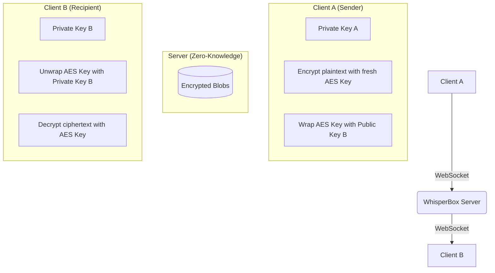

# WhisperBox 🔒

A high-security, end-to-end encrypted messaging application built with React, TypeScript, and the native Web Crypto API.

## Core Philosophy

WhisperBox is built on a "Zero-Knowledge" architecture. The server stores only encrypted blobs; it never sees your plaintext, your password, or your private keys. All encryption and decryption happen strictly in your browser.

---

## 🛡️ Encryption Model

WhisperBox uses a multi-layered security approach combining asymmetric and symmetric cryptography.

### 1. Account Security (Key Wrapping)

- **PBKDF2**: Your password is never sent to the server. Instead, it is used locally to derive a 256-bit AES wrapping key using PBKDF2 with 100,000 iterations.
- **AES-GCM**: Your RSA private key is encrypted (wrapped) with this derived key before being sent to the server for storage.

### 2. Identity (RSA-OAEP)

- Each user generates a **2048-bit RSA-OAEP** keypair upon registration.
- Your **Public Key** is shared with other users so they can encrypt messages for you.
- Your **Private Key** never leaves your browser in unencrypted form.

### 3. Messaging (AES-GCM)

- Every message uses a **fresh 256-bit AES-GCM key**.
- **Double Wrapping**: The AES key is encrypted twice:
  1. Once with the **Recipient's RSA Public Key** (so they can read it).
  2. Once with the **Sender's RSA Public Key** (so you can read your own outbox).
- This ensures perfect forward secrecy at the message level — if one message key is compromised, others remain secure.

---

## 🏗️ Architecture

---

## 🚀 Tech Stack

| Layer          | Technology                        |
| -------------- | --------------------------------- |
| **Frontend**   | React 19 + TypeScript 5           |
| **Styling**    | Tailwind CSS 4                    |
| **State**      | Zustand                           |
| **Crypto**     | Native Web Crypto API             |
| **Networking** | Typed Fetch + WebSockets          |
| **Storage**    | IndexedDB (idb) for local caching |
| **Build**      | Vite 6                            |

---

## 🔒 Security Decisions

1. **Memory-Only Secrets**: Access tokens, refresh tokens, and unwrapped RSA private keys are stored strictly in memory variables. They are never written to `localStorage` or `sessionStorage`.
2. **Automatic Wipe**: All sensitive data is purged instantly upon logout or session expiration.
3. **Hardware-Backed Crypto**: Uses the browser's native `window.crypto.subtle` for all cryptographic operations, ensuring side-channel resistance where possible.
4. **No Dependencies**: All core cryptography is implemented using standard browser APIs — no third-party crypto libraries (like CryptoJS) that could introduce vulnerabilities or bloat.
5. **WebSocket + HTTP Fallback**: Real-time delivery via WebSockets is prioritized, with an automatic fallback to signed HTTP requests if the socket is interrupted.

---

## 🛠️ Development

### Prerequisites

- Node.js (v18+)
- npm

### Getting Started

1. Clone the repository
2. Install dependencies: `npm install`
3. Start the dev server: `npm run dev`
4. Run tests: `npm test`
5. Lint the project: `npm run lint`

---

## ⚖️ License

MIT
